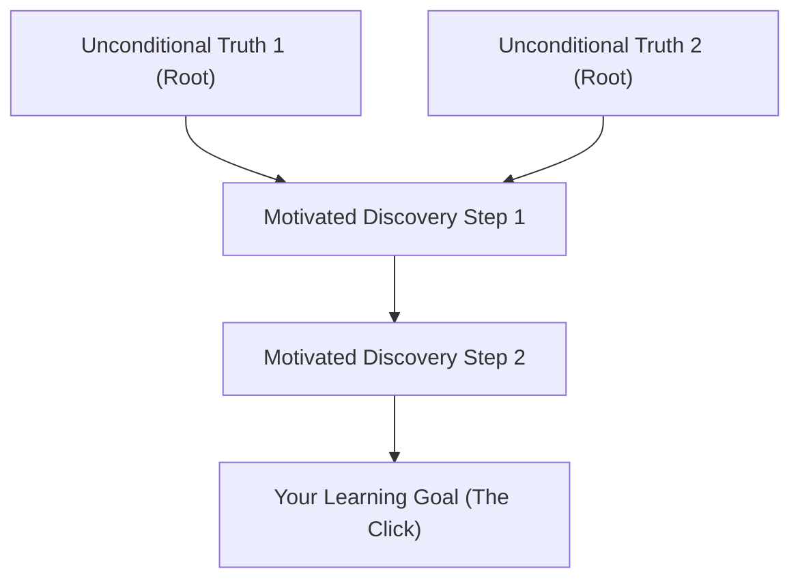
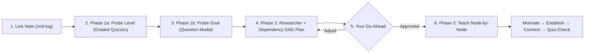

# learn (Antigravity Edition)

An **AI Learning System** for **Google Antigravity**, adapted from [Amos Blomqvist's *How I Use AI to Learn Things*](https://www.youtube.com/watch?v=kzcI5F4tGiU) ([original Pi repo](https://github.com/amosblomqvist/learn)).

Instead of requiring a terminal TUI (`pi`) and `tmux` extensions, this repository runs natively inside **Antigravity** using its built-in interactive question modals, multimodal image inspection (`view_file`), research/maker subagents, and an Obsidian Markdown session logger.

---

## 1. Quick Start & Vault Setup

1. **Clone this repository and open it in Antigravity**:
   ```bash
   git clone git@github.com:yrojx/learn.git
   ```
2. **Ask Antigravity to set up your Obsidian vault**:
   In the Antigravity chat panel, tell it where to create (or link) your vault:

   ```text
   Set up my Obsidian vault at <path-to-vault>
   ```

   - **Outside this repo**: Pass a path, e.g. `Set up my Obsidian vault at ~/Documents/my-vault`
   - **Inside this repo**: Pass just a name, e.g. `Set up my Obsidian vault named my-vault` (creates `./my-vault/`)

   Antigravity will automatically:
   - Install the Mermaid/SVG rendering dependencies (reusing your local Chrome/Chromium without downloading a duplicate browser).
   - Create your vault directory and its `viz/` attachment folder.
   - Pre-configure `.obsidian/app.json` (`attachmentFolderPath: "viz"`) so `![[viz-...png|500]]` diagram embeds resolve out of the box.

3. **Side-by-Side Window Setup**:
   - **Left Side — Antigravity**: Open this repository as your workspace to chat and answer interactive **Quiz / Question popups**.
   - **Right Side — Obsidian**: Open your vault and switch your active note to **Reading View** (`Cmd + E` / `Ctrl + E`) so callouts (`> [!quote] YOU`, `> [!abstract] ANTIGRAVITY`, `> [!question] Quiz`), `$LaTeX$` math, Mermaid graphs, and `![[viz-...png|500]]` diagrams render live as you go.

---

## 2. Starting & Ending a Learning Session

### Option A — Create the note in Obsidian first (Video style)
1. Create a new note in Obsidian inside your vault (e.g. `Calculus.md`).
2. In Antigravity chat, run:
   ```text
   /md-log Calculus.md
   Then teach me <topic>
   ```

### Option B — Let Antigravity create and link it automatically
Just tell Antigravity what you want to learn:
```text
I want to learn how TCP works.
```
Antigravity will automatically create `<vault>/TCP.md` (using a clean, normal title without dashes), link it, and mirror the entire session into it.

### Stopping the log
When you want to stop mirroring to the current note, type:
```text
/md-unlog
```

---

## 3. Core Philosophy (Why This System Works)

Two brains can hold the same facts, yet one holds a **pile of disconnected lone facts** (memorization, which rots) while the other holds a **dependency graph** where every fact hangs off a few rock-solid foundations (understanding, which self-preserves and compresses).

The felt goal is **the click**: the moment a pile of facts collapses into a few generating ideas.

To make your brain safely lock knowledge in without hedging, the system follows two non-negotiable principles:

1. **Principle i — Unconditional Truths First (Building the Nodes)**
   - Starts from caveat-free, always-true foundations you can accept *at face value* (e.g., universal statements like *"ALL communication between computers is done through {sending packets}"* or genuine definitions).
   - Because nothing more fundamental will later contradict them, your brain commits to them immediately.
2. **Principle ii — "How Could I Have Discovered This?" (Building the Edges)**
   - Facts feel arbitrary when decreed from nowhere. Every step is **motivated** by the problem that forced someone to invent or reach for it (3Blue1Brown style).



---

## 4. The 3-Phase Learning Flow (`Probe → Plan → Teach`)



Every topic — whether a 5-minute concept or a multi-hour deep dive — goes through these three phases in order:

### Phase 1: Probe (Never Skipped)

Before teaching a single word, Antigravity maps two things using interactive popup modals:

#### 1a. Mapping Your Current Level (`Quiz Mode`)
Antigravity asks a sequence of graded multiple-choice questions to bracket the **edge of your understanding** (your *floor* — what you reliably know — and your *ceiling* — where it runs out) across every prerequisite strand.

- **Never guess!** Every quiz includes **`I don't know`** as the last option. Pick **`I don't know`** whenever you aren't sure. In this system, `I don't know` is *not* graded as a red `✗` failure — it is a clean signal of a genuine knowledge gap so the teacher knows where to start.
- **Expect questions to jump in difficulty.** Getting questions right doesn't mean the probe is "done" — Antigravity will binary-search upward until something breaks so it finds your true ceiling.
- **Getting one wrong won't start the lesson immediately.** Antigravity will probe around a wrong answer to see if it was a slip, an isolated gap, or a deeper misconception.
- **Add notes anytime.** Use the write-in input in the modal if you want to explain your reasoning or add context.

#### 1b. Clarifying Your Learning Goal (`Goal Mode`)
"I want to understand LLMs" can mean ten different things. Antigravity asks ungraded multiple-choice questions (where you can also write in your own answer) to pin down the exact outcome you want.

---

### Phase 2: Plan (Your Checkpoint)

Once your current edge and goal are clear, Antigravity pauses to plan:

1. **Truth Verification (`researcher` subagent)**: Runs a background web researcher to verify first principles, definitions, and common misconceptions so nothing is taught from fuzzy memory.
2. **The Proposed Plan + Dependency DAG**: Presents:
   - **The approach in prose** (what you'll cover, in what order, and why, starting right at your Phase 1a edge).
   - **A small Mermaid dependency map** showing the unconditional truths at the roots, each derived node hanging off them, and your goal at the bottom.
3. **Wait for Your Go-Ahead**: Antigravity **stops here** and waits for your approval. Check that the root nodes make sense to you and the scope matches what you want.

---

### Phase 3: Teach (The Node-by-Node Loop)

Antigravity walks through the dependency map **one node at a time**. Every single node (both foundational unconditional truths and derived steps) goes through four steps:

1. **Motivate** — *Why do we need this node right now?* What problem or gap forces us to bring this in?
2. **Establish** —
   - For an **unconditional truth**: Stated plainly, with zero caveats.
   - For a **derived step**: Built up via motivated discovery — either **Socratic** (posing the problem in a graded quiz so you attempt the discovery first) or **Expository** (narrating the discovery path 3Blue1Brown-style).
3. **Connect** — Explicitly shows how this new node hangs off the previous nodes in your graph.
4. **Quiz-Check** — Before moving to the next node, Antigravity pops up a quick graded quiz to verify the node actually locked in. If you miss it or pick `I don't know`, it stops and repairs that foundation before building anything on top of it.

#### Verified Diagrams (`visualize` skill)
Whenever a relationship or geometry is clearer as a picture than prose:
- Antigravity dispatches a **`mermaid-maker`** (for dependency graphs, flows, state machines, sequences) or **`svg-maker`** (for coordinate geometry, vectors, number lines, custom spatial layouts) subagent.
- The maker renders the diagram to a crisp 2x PNG, **visually inspects the image** (`view_file`) to verify arrows, labels, and geometry, saves it to `<vault>/viz/`, and embeds it into your Obsidian note via `![[viz-...png|500]]`.

---

## 5. Useful Steering Prompts Mid-Lesson

| What you want | What to say |
| :--- | :--- |
| Switch to Socratic (let me figure it out) | *"Make this step Socratic — quiz me to see if I can discover it."* |
| Switch to Expository (low energy / just explain it) | *"I'm low energy right now, walk me through this part expository-style."* |
| Challenge a "foundation" that doesn't feel obvious | *"Wait — why is that true? That doesn't feel like an unconditional truth to me yet."* |
| Ask for a diagram | *"Can you visualize this relationship / geometry for me?"* |
| Double-check a fact or formula | *"Use the researcher subagent to verify that claim."* |
| Change the linked Obsidian file | *"`/md-log new-topic.md`"* |

---

## 6. How Pi Components Map to Antigravity

| Original Pi Component | Antigravity Equivalent | File / Location |
| :--- | :--- | :--- |
| **Workspace Rule** | Auto-loads the learning system & onboarding commands | [`GEMINI.md`](./GEMINI.md) |
| **`teach` Skill** | 2-Principle philosophy & 3-Phase (`Probe → Plan → Teach`) loop | [`.agents/skills/teach/SKILL.md`](./.agents/skills/teach/SKILL.md) |
| **`visualize` Skill** | Render-and-inspect diagram loop (Mermaid & hand-authored SVG) | [`.agents/skills/visualize/SKILL.md`](./.agents/skills/visualize/SKILL.md) |
| **`quiz` & `ask-user-question`** | Native blocking `ask_question` modal (**Quiz Mode** with shuffled bare-claim options + `"I don't know"` + instant ✓/✗ grading, and **Goal Mode**) | Configured in [`teach/SKILL.md`](./.agents/skills/teach/SKILL.md) |
| **`md-log` (Obsidian Mirror)** | CLI logger writing `> [!quote] YOU`, `> [!abstract] ANTIGRAVITY`, and `> [!question] Quiz` callouts into your Obsidian vault | [`.agents/skills/teach/scripts/md_log.mjs`](./.agents/skills/teach/scripts/md_log.mjs) |
| **`visual-tools` (Mermaid + SVG)** | 2x Retina PNG renderer using `@mermaid-js/mermaid-cli` & headless Chrome + multimodal verification via `view_file` | [`.agents/skills/visualize/scripts/render_viz.mjs`](./.agents/skills/visualize/scripts/render_viz.mjs) |
| **Subagents (`researcher`, `mermaid-maker`, `svg-maker`)** | Native `invoke_subagent` (`research` and `self`) with dedicated subagent references | [`.agents/skills/visualize/references/`](./.agents/skills/visualize/references/) |

## Credits

- Original concept, pedagogy, and skills by [Amos Blomqvist](https://github.com/amosblomqvist/learn) ([YouTube Video](https://www.youtube.com/watch?v=kzcI5F4tGiU)).
